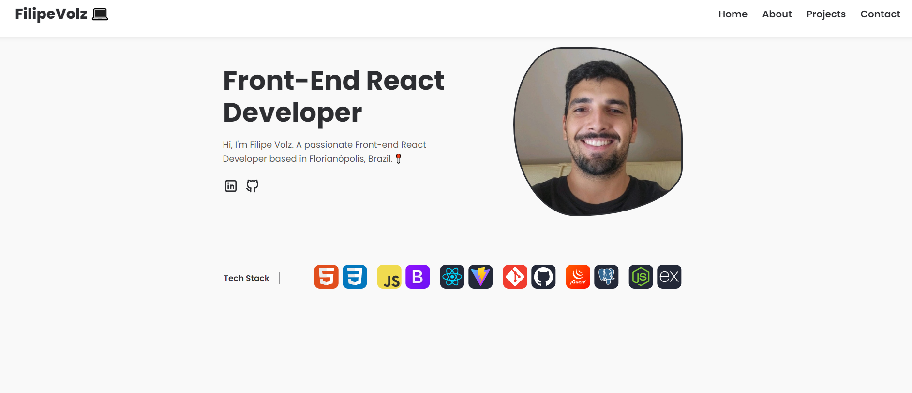

<h1 align="center"> Portfólio </h1>

# Meu Portfólio
Bem-vindo ao meu portfólio! Aqui você encontrará um site pessoal desenvolvido com React.js, apresentando várias seções cuidadosamente projetadas para proporcionar uma experiência informativa e envolvente.

Este portfólio foi criado para destacar minha jornada como desenvolvedor e para fornecer uma visão abrangente sobre meu trabalho, habilidades e projetos. Ao navegar pelas diferentes seções, você terá a oportunidade de conhecer mais sobre mim, minha experiência e os projetos nos quais estou trabalhando.

Espero que este site não apenas forneça informações úteis, mas também transmita minha paixão e dedicação pelo desenvolvimento web. Sinta-se à vontade para explorar e entrar em contato comigo se tiver alguma dúvida ou interesse em colaborar.

Aproveite sua visita!

## Componentes

### Header

O componente `Header` é o cabeçalho do site e contém o nome do desenvolvedor e links de navegação para outras seções do site.

### Hero

O componente `Hero` é a seção principal do site e inclui uma mensagem de boas-vindas e informações básicas sobre o desenvolvedor. Também exibe ícones representando as habilidades técnicas do desenvolvedor.

### About

O componente `About` fornece uma biografia detalhada do desenvolvedor, incluindo sua localização e uma breve descrição sobre suas experiências e paixões na área de desenvolvimento front-end.

### Projects

O componente `Projects` lista os projetos do GitHub do desenvolvedor. Ele se conecta à API do GitHub para recuperar informações sobre os repositórios selecionados. Para cada projeto, exibe o nome, a linguagem de programação, a descrição e os tópicos relacionados.

### Contact

O componente `Contact` exibe informações de contato, como localização e endereço de e-mail do desenvolvedor. Também inclui links para as redes sociais do desenvolvedor, como LinkedIn e GitHub.

### Footer

O componente `Footer` é o rodapé do site e inclui informações de direitos autorais e links para redes sociais.

## Funcionalidades do React Utilizadas

- **Componentes Funcionais**: Todos os componentes são escritos como funções de componentes funcionais do React.
- **Hooks de Estado (useState)**: Utilizados para gerenciar estados locais nos componentes, como o estado do menu hamburguer no componente `Navbar`.
- **Hooks de Efeito (useEffect)**: Utilizados para executar operações assíncronas, como a busca por repositórios no GitHub no componente `Projects`, após a montagem do componente.
- **Props**: Utilizadas para passar dados entre componentes, como os ícones de habilidades no componente `Hero`.
- **Fetch API**: Utilizada para fazer requisições HTTP assíncronas para a API do GitHub no componente `Projects`.
- **Fragmentos**: Utilizados para agrupar múltiplos elementos filhos em um único retorno de componente, como no componente `Home`.

## Tecnologias Utilizadas

- **React.js**: Biblioteca JavaScript de código aberto para criar interfaces de usuário.
- **GitHub API**: API para acessar dados e funcionalidades do GitHub, usada para listar os projetos do usuário.
- **CSS**: Linguagem de estilo utilizada para estilizar os componentes e o layout do site.
- **Fetch API**: API para fazer requisições HTTP assíncronas em JavaScript.

## Tech Skills

As habilidades técnicas do desenvolvedor são representadas pelos ícones exibidos no componente `Hero`. As tecnologias e ferramentas incluem:

- HTML
- CSS
- JavaScript
- Bootstrap
- React.js
- Vite
- Git
- GitHub
- jQuery
- PostgreSQL
- Node.js
- Express

## Como Executar

Para executar este projeto localmente, siga estas etapas:

1. Clone este repositório.
2. No diretório do projeto, execute `npm install` para instalar as dependências.
3. Após a instalação das dependências, execute `npm start` para iniciar o servidor de desenvolvimento.
4. Abra [http://localhost:3000](http://localhost:3000) no navegador para visualizar o site.

## Contribuição

Contribuições são bem-vindas! Sinta-se à vontade para propor melhorias, correções de bugs ou novos recursos. Para contribuir com este projeto, siga estas etapas:

1. Faça um fork deste repositório.
2. Crie um branch para sua feature (`git checkout -b feature/nova-feature`).
3. Faça commit de suas alterações (`git commit -am 'Adiciona nova feature'`).
4. Faça push para o branch (`git push origin feature/nova-feature`).
5. Abra um Pull Request.